<div align="center">

# RTK School CRM · веб-клиент

**Клиент CRM ИТ Школы Ростелекома: SvelteKit-SPA на дизайн-системе rt-ui, без сырого CSS — четыре роли, четыре темы, десктоп и телефон**

<sub>Команда **«Тесткит»** — [github.com/lct-testkit](https://github.com/lct-testkit)</sub>

<!--STATS-->
**47** экранов &nbsp;·&nbsp; **175** из **203** ручек API с экранами &nbsp;·&nbsp; **66** компонентов `lib/ui` &nbsp;·&nbsp; **15** блоков B1–B15 (приняты) &nbsp;·&nbsp; **265** тестов клиента &nbsp;·&nbsp; **4** роли &nbsp;·&nbsp; **4** темы
<!--/STATS-->

[Быстрый старт](#быстрый-старт) · [Примеры](#примеры-использования) · [Как устроено](#как-устроено) · [Блоки интерфейса](#блоки-интерфейса) · [Редактор воронки](#редактор-воронки-графовый-конструктор) · [Битрикс24](#интеграция-с-битрикс24) · [Соглашения](#соглашения) · [Проверка качества](#проверка-качества) · [Образ web](#образ-web) · [Корневой README](https://github.com/lct-testkit/.github#readme) · [Бэкенд](https://github.com/lct-testkit/backend#readme)

| 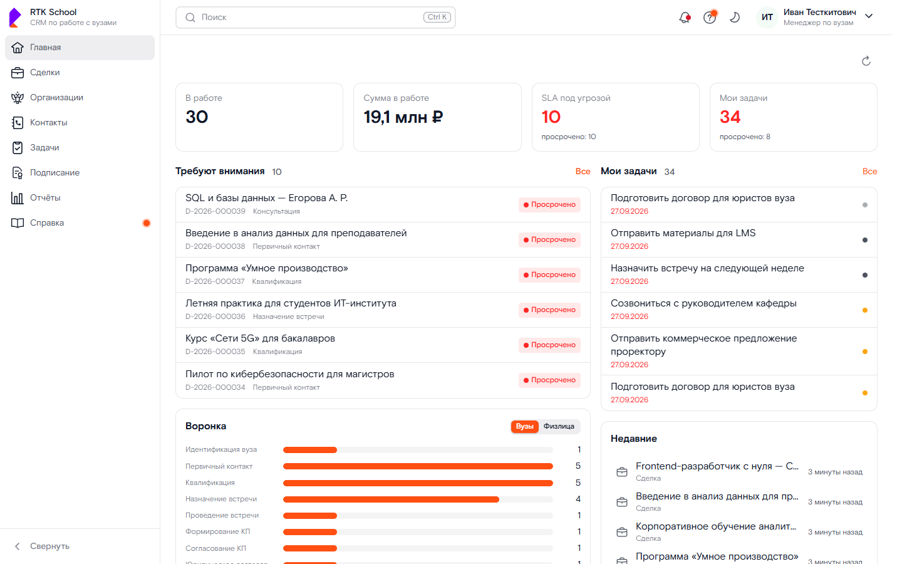 | 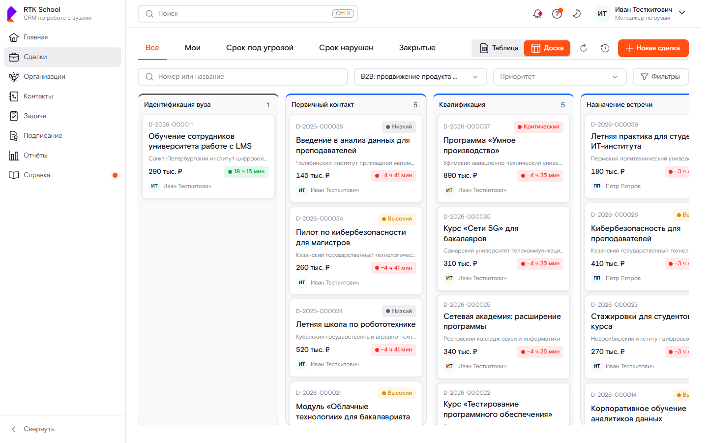 |
|:-:|:-:|
| *Главная КАМ — светлая* | *Сделки доской по статусам воронки* |

<sub>Экраны собраны из блоков `src/lib/ui` и компонентов rt-ui. Запуск бэкенда, стенд с образом `web`, порты, демо-данные и устранение неполадок — в [корневом README](https://github.com/lct-testkit/.github#readme).</sub>

</div>

## Почему это интересно

* **Экран собирается из принятых блоков, а не наоборот.** 65 компонентов в `src/lib/ui` (53 общих и 12 полей форм) делались по одному, каждый блок принимал заказчик на живом стенде: **B1–B15 приняты**.
* **Дизайн-система везде, где она что-то умеет.** Кнопки, поля, таблица `TableGrid`, окна, вкладки, тосты — компоненты rt-ui. Своё — раскладка, карточка-секция, аватар, скелетон, плитка KPI, ввод OTP: их в rt-ui нет.
* **Tailwind v4 поверх rt-ui без сырого CSS.** Токены дизайн-системы вшиты в тему Tailwind: `bg-surface text-muted rounded-md` сами следуют четырём темам, `dark:`-вариантов нет. Слой rt-ui лежит ниже `utilities` — утилита всегда побеждает стиль компонента.
* **Клиент типизирован по OpenAPI.** Типы генерируются из схемы бэкенда (203 операции). Ошибки — RFC 7807 в одну человеческую фразу; создание идёт с `Idempotency-Key`, правка — с `If-Match` (конфликт 409 — плашка «Обновить»); пагинация курсорная; CSRF.
* **Один бандл — два режима.** `demo` (выбор роли в один клик) и `prod` (вход через Keycloak, серверная сессия) переключает `/config.json`; пересобирать образ не нужно.
* **Телефон — не уменьшенный десктоп.** Таблицы становятся карточками, главная кнопка плавающая или внизу, поля размера l (48 px), нажимаемые цели — до 44 px; это проверяет `taps.mjs`.
* **Проверки ходят по живому клиенту.** `qa-all` (все маршруты × роли × размеры), `buttons` (каждая кнопка каждого экрана, изменения на сервере подменяются заглушкой), `tops`/`axes`/`guides` (выравнивание линиями), `taps`, 40 сценариев на живом бэкенде.
* **Каталог блоков `/dev/blocks`.** Каждый блок в своих состояниях (норма, пусто, ошибка, длинный текст), светлая и тёмная темы, ширины 1440, 1024, 768, 390 и 360. В production-сборку не попадает.

## Как это выглядит

| 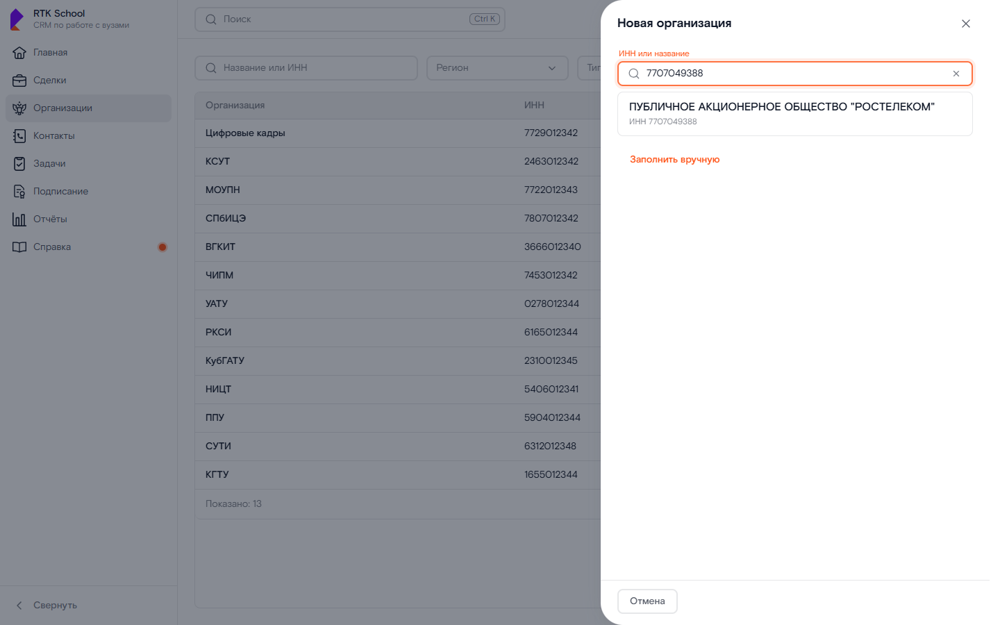 | 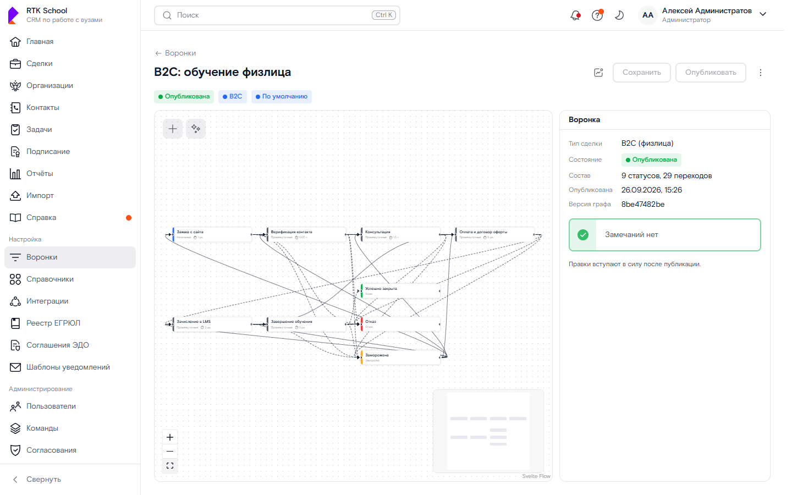 |
|:-:|:-:|
| *панель формы (`FormDrawer`, поля `ui/fields`)* | *редактор воронки на холсте `@xyflow/svelte`* |

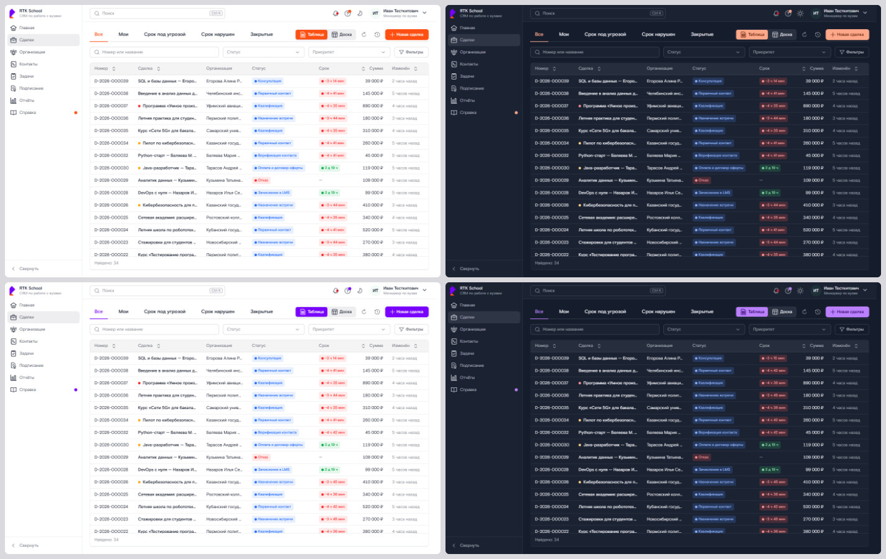

*Одни и те же «Сделки» в четырёх темах: тема — класс `Theme_root_<тема>` на `<body>`, все цвета — токены `--atmr-*`.*

| 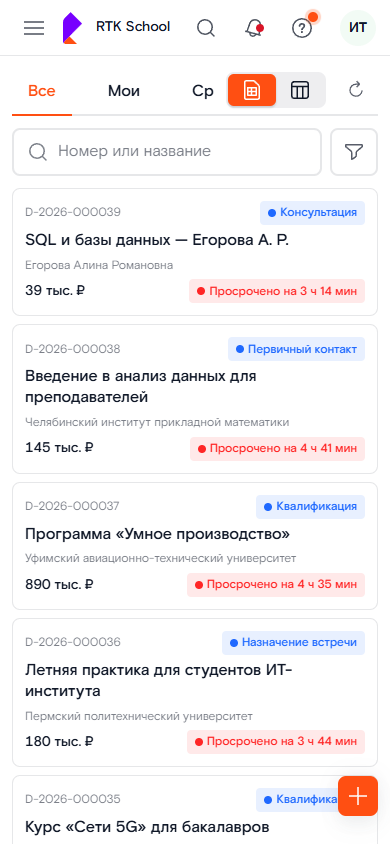 | 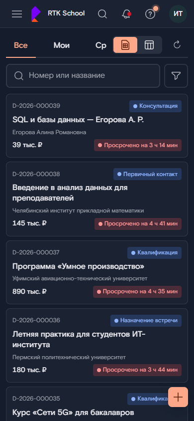 |
|:-:|:-:|
| *телефон 390 px: список, карточка, панель формы, меню* | *те же экраны в тёмной теме* |

## Быстрый старт

Нужен работающий бэкенд (Docker, порт 8080) — как его поднять, описано в [корневом README](https://github.com/lct-testkit/.github#быстрый-старт). Для `pnpm install` нужен токен чтения приватного пакета `@lct-testkit/rt-ui` из GitHub Packages (classic PAT со scope `read:packages`; один раз на машине: `pnpm config set "//npm.pkg.github.com/:_authToken" <токен>` — pnpm 11 не читает токен из `.npmrc` репозитория), для шрифта — `static/fonts/*.woff` (без него запасная гарнитура; шрифт выдаёт заказчик, в git его нет).

```bash
pnpm install
```

```bash
pnpm dev
```

Откроется http://localhost:5273; `/api`, `/public`, `/health`, `/auth` проксируются на `BACKEND_URL` (по умолчанию http://localhost:8080). Экран входа в demo-режиме — «Выберите роль»; учётки (`kam.ivanov`, `head.petrov`, `admin.crm`, `admin.volkov`, `auditor.smirnov`) и пароли — только для демо, см. [корневой README](https://github.com/lct-testkit/.github#адреса-порты-и-учётные-записи).

### Два режима

Режим задаёт `static/config.json` → `mode`; в контейнере — переменная `APP_MODE` (конфиг пишется при старте).

| | demo | prod |
|---|---|---|
| Экран входа | «Выберите роль»: карточки учётных записей | одна кнопка «Войти» → Keycloak |
| Аутентификация | Keycloak password grant, токены в `localStorage` (`rtk.demo.tokens`), `Authorization: Bearer`, тихое обновление | OIDC + PKCE на бэкенде, серверная сессия (httpOnly-cookie `crm_sid`), CSRF (`crm_csrf` + `X-CSRF-Token`) |
| Демо-пароли и client secret в бандле | да (`/config.json`) | нет |

Если `/config.json` не прочитан, клиент выбирает prod; учётки в prod игнорируются, даже если они есть в файле (`src/lib/config.ts`).

## Стек

| Слой | Пакеты | Версии из `package.json` |
|---|---|---|
| Каркас | `@sveltejs/kit` (SPA, `adapter-static`, `fallback: 'index.html'`) · `svelte` (руны везде, кроме `node_modules`) | ^2.63.0 · ^5.56.1 |
| Сборка | `vite` · `@sveltejs/vite-plugin-svelte` | ^8.0.16 · ^7.1.2 |
| Язык | `typescript` (`strict`) · `svelte-check` | ^6.0.3 · ^4.6.0 |
| Стили | `tailwindcss` · `@tailwindcss/vite` · `@tailwindcss/typography` | ^4.3.3 · ^4.3.3 · ^0.5.20 |
| Дизайн-система | `@lct-testkit/rt-ui` (порт на Svelte, [`../rt-ui`](https://github.com/lct-testkit/rt-ui#readme)) | `0.1.1` из GitHub Packages (`.npmrc`) |
| API | `openapi-fetch` · `openapi-typescript` (генерация типов) | ^0.14.0 · ^7.9.0 |
| Граф воронки, PDF | `@xyflow/svelte` · `pdfjs-dist` | ^1.0.0 · ^5.4.0 |
| Markdown | `marked` · `dompurify` (комментарии и справка без raw HTML) | ^16.0.0 · ^3.2.6 |
| Даты | `dayjs` — нужен компонентам rt-ui (`InputDate`, `PickerDate`), в `src` напрямую не импортируется | ^1.11.13 |
| Проверки | `vitest` · `playwright` · `eslint` + `typescript-eslint` + `eslint-plugin-svelte` | ^3.2.4 · ^1.55.0 · ^10.4.1 |
| Среда | pnpm 11.13.1 (`packageManager` в `package.json`, тот же в `Dockerfile` и CI) · образ `node:22-alpine` (по digest) | для `pnpm install` — по `engines` зависимостей (`engine-strict=true`): Node 20.19+, 22.13+ или 24+ |

## Примеры использования

Фрагменты сокращены из `src/lib/features/config/catalog`. Список справочника — страница из блоков; таблица сама не сортирует и не режет на страницы, она показывает то, что ей передали:

```svelte
<script lang="ts">
  const list = createResource((signal) => unwrap(api.GET('/api/regions', { signal })).then((r) => r.items));
  onMount(() => void list.reload());
  const columns: Col<Region>[] = [
    { key: 'name', title: 'Регион', width: 'minmax(220px, 2fr)', render: nameCell },
    { key: 'federal_district', title: 'Округ', width: 'minmax(160px, 1fr)', drop: 2, render: districtCell }
  ];
</script>

{#snippet nameCell(r: Region)}<TableCell><span class="t-body-m-strong">{r.name}</span></TableCell>{/snippet}

<CatalogPage active="regions">
  {#snippet toolbar()}<FilterBar search={readQuery('q')} placeholder="Название, округ или код" onSearch={(v) => setQuery({ q: v })} />{/snippet}
  <CatalogList {rows} {columns} {card} loading={list.loading} error={list.error} onRetry={() => list.reload()} emptyText="Регионов нет" />
</CatalogPage>
```

Форма — панель `FormDrawer`: Enter сохраняет, закрытие с несохранённым вводом спрашивает, общая ошибка и плашка 409 стоят над кнопками; правка идёт с `If-Match`, создание — с `Idempotency-Key`:

```svelte
<FormDrawer {open} title={isNew ? 'Новое направление' : name} {saving} {formError} {conflict} onSave={save} {onClose} onReload={reloadVersion}>
  <TextField label="Название" bind:value={name} error={errors.name} maxlength={255} />
  <Pick label="Входит в" bind:value={parent} items={parents} clearable search hint="Пусто — направление верхнего уровня" />
</FormDrawer>
```

```ts
await unwrap(api.PATCH('/api/directions/{direction_id}', { params: { path: { direction_id: item.id } }, body, headers: ifMatch(version) }));
await unwrap(api.POST('/api/directions', { body, headers: idem(idemKey) }));   // один ключ на одну отправку формы
```

Сообщения и подтверждения — без своих окон в экранах:

```ts
toast.success('Направление сохранено');               // toast.error(e) превращает ApiError в одну фразу; для 5xx добавляет код обращения
if (await confirm({ title: 'Удалить сделку D-2026-00431?', danger: true })) { … }
```

## Как устроено

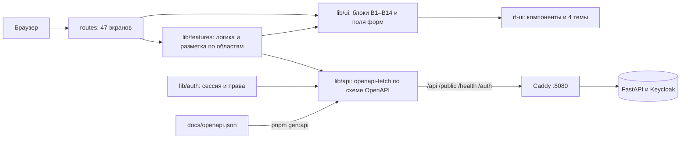
```mermaid
flowchart LR
  BR["Браузер"] --> RT["routes: 47 экранов"]
  RT --> FE["lib/features: логика и разметка по областям"]
  RT --> UI["lib/ui: блоки B1–B14 и поля форм"]
  FE --> UI
  UI --> DS["rt-ui: компоненты и 4 темы"]
  FE --> API["lib/api: openapi-fetch по схеме OpenAPI"]
  AU["lib/auth: сессия и права"] --> API
  SC["docs/openapi.json"] -->|"pnpm gen:api"| API
  API -->|"/api /public /health /auth"| CD["Caddy :8080"]
  CD --> BE[("FastAPI и Keycloak")]
```

```
src/app.css                 Tailwind, токены rt-ui в теме Tailwind (bg-surface, text-muted, t-body-m …), слои, переходы колец и рамок
src/routes/                 login · (app) экраны за входом · sign, verify, invite — публичные · dev/blocks — каталог блоков (только dev)
src/lib/api/                client.ts (openapi-fetch + middleware), errors.ts (RFC 7807), pager.svelte.ts, upload.ts, people.svelte.ts; schema.d.ts — генерируется
src/lib/auth/               session.svelte.ts (профиль, session.can), tokens.ts (только demo), events.ts (401, согласие, смена пароля, блокировка)
src/lib/config.ts, nav.ts   runtime-конфиг /config.json; меню, заголовки и посадочная страница по правам
src/lib/features/<область>/ crm · config · identity · signing · home: логика (*.ts, *.svelte.ts, тесты рядом) и разметка экранов
src/lib/ui/                 54 общих компонента (AppShell, TopBar, SideNav, Page, PageHeader, FilterBar, DataTable …) и ui/fields — 12 полей форм
src/lib/stores/             theme.svelte.ts: четыре темы, класс Theme_root_<тема> на <body>; help-attention.svelte.ts: точка «загляните» у справки, пока её не открыли
src/lib/utils/              format, markdown (marked + DOMPurify), query-state (фильтры в адресной строке), debounce, platform
src/lib/styles/             fonts.css: Rostelecom Basis и запасная гарнитура
src/lib/content/help/       13 глав справки /help (Markdown)
static/                     config.json, favicon.svg, logo.svg, robots.txt, fonts/ (не в git)
deploy/                     Caddyfile.web, docker-entrypoint.sh — образ web
tools/                      инструменты проверки, сеялка демо-данных, scenarios/ (Playwright)
docs/                       документация клиента; docs/img — картинки этого файла
```

285 файлов `.svelte` и 141 `.ts` в `src` (по состоянию на 22.09.2026). Области `src/lib/features`:

| Область | Что внутри |
|---|---|
| `crm` | сделки (список, доска, карточка, переходы с чек-листом условий), организации и реквизиты ЕГРЮЛ, контакты, задачи, комментарии, файлы, уведомления, «недавние» |
| `config` | воронки (редактор графа), справочники, импорт (мастер), отчёты и дашборды, реестр ЕГРЮЛ, интеграции, шаблоны уведомлений |
| `identity` | профиль, сессии, пароль, пользователи, команды, согласования («четыре глаза»), аудит, увольнение, удаление ПДн, настройки |
| `signing` | подписание ПЭП: мастер отправки, входящие, ввод кода OTP, просмотр PDF, проверка подписи, соглашения ЭДО |
| `home` | данные главной: плитки KPI, «требуют внимания», воронка |
| `help` | живые образцы rt-ui в главе «Дизайн-система» справки (`DesignSystemShowcase`): кнопки, поля, таблица, графики, темы, токены |

## Блоки интерфейса

План, критерии приёмки и правила раскладки — [`docs/REBUILD-PLAN.md`](docs/REBUILD-PLAN.md). Общие критерии для каждого блока: отступы кратны шагу дизайн-системы, типографика только из её шкалы, ховер, фокус и disabled как у rt-ui, светлая и тёмная темы, ширины 1440, 1024, 390 и 360, клавиатура и русская раскладка работают.

| Блок | Что входит | Где лежит (`src/lib`) | Приёмка |
|---|---|---|---|
| B1 Верхняя панель | поиск (Ctrl+K), колокольчик с красной точкой, справка, тема, профиль | `ui/TopBar`, `TopBarIcon`, `GlobalSearch`, `SearchInput`, `Keycap`; `features/crm/notifications/NotificationBell` | ✅ |
| B2 Боковое меню и бренд | пункты по правам, счётчик «Подписание», свёрнутый режим, drawer на телефоне | `ui/SideNav`, `Brand`, `NavIcon`, `AppShell` | ✅ |
| B3 Шапка страницы | заголовок, назад, метки статуса, действия; высота фиксирована, без прыжков | `ui/Page`, `PageHeader`, `PrimaryAction` | ✅ |
| B4 Панель фильтров | поиск на всю ширину, поля, «Фильтры» с числом включённых, сброс; на телефоне — панель | `ui/FilterBar`, `FilterRow`, `SearchField`, `filter-row.ts` | ✅ |
| B5 Таблица | `TableGrid` rt-ui, сортировка, выбор строк, «показать ещё», колонки убираются по измерению (`drop`); телефон — карточки | `ui/DataTable`, `TableCell` | ✅ |
| B6 Списки-строки | задачи, уведомления, недавние, история | `ui/RowList`, `ListRow` | ✅ |
| B7 Карточка объекта | шапка, лента шагов, вкладки, секции-карточки | `ui/Card`, `StatusSteps`, `StatusChip`, `TabsBar` | ✅ |
| B8 Ключ — значение | сетка полей на одной базовой линии | `ui/KeyValue`, `KeyValueList` | ✅ |
| B9 Формы | панель и окно, поля, выбор с поиском, даты, файл, ошибки полей, подвал | `ui/FormDrawer`, `FormModal`, `FormFooter`, `FormRow`, `FormSection`, `AppDrawer`, `AppModal`, `fields/*`, `UserPicker` | ✅ |
| B10 Сообщения | плашки `Notice`, тосты, подтверждения | `ui/Notice`, `toast.svelte.ts`, `confirm.svelte.ts`, `ConfirmModal`, `BtnSizeScope` | ✅ |
| B11 Вкладки, сегменты, чипы | `TabsGroup`, `SegmentedControl`, `Chip` rt-ui | `ui/TabsBar`, `StatusChip` | ✅ (принят с B4 и B7) |
| B12 Пусто, загрузка, ошибка | единые состояния | `ui/Skeleton`, `EmptyState`, `ErrorState` | ✅ |
| B13 Мастера | шаги и карточка шага (импорт, увольнение, отправка на подпись, архивация статуса) | `ui/WizardSteps`, `WizardCard` | ✅ |
| B14 Публичные страницы | вход, подпись, проверка, приглашение | `ui/PublicShell`; `features/identity/InviteCard`; `features/signing/SignOutcome` | ✅ |
| B15 Мобильная версия | проход по всем блокам на 390 и 360 px | `app.css` (зона касания до 44 px), `BtnSizeScope` | ✅ |

Каталог `/dev/blocks` виден только при запущенном `pnpm dev`: http://localhost:5273/dev/blocks (вход не нужен). Демо лежат в `src/routes/dev/blocks/demos/` (B01–B10, B12–B14; у B11 и B15 своих демо нет — B11 показан в B04 и B07, B15 — проход по всем), рамка одного блока — `/dev/blocks/frame?demo=<id>&theme=<тема>`. Демо подключаются через `import.meta.glob` только при `import.meta.env.DEV`, а `src/routes/dev/+layout.ts` отвечает на `/dev/*` ошибкой 404 в production-сборке.

## Редактор воронки: графовый конструктор

Кейс прямо разрешает «креатив» в конструкторе workflow (`new_spec.md §4.11`) — вместо жёстко зашитых 14 шагов воронка целиком редактируется графом: узлы и рёбра, без единой правки кода. Это не просто картинка статусов — за каждым узлом и ребром стоит реальное поведение бэкенда.


*Тот же конструктор на короткой демо-воронке (4 статуса) — виден весь холст сразу: сеть переходов между «Успех», «Отказ» и «Пауза» пунктиром, автораскладка слева направо.*

* **Узел — статус.** Код (`^[a-z][a-z0-9_]{1,63}$`, неизменяем после создания — на него ссылаются данные), название (правится в любой момент, даже у опубликованного статуса), тип — `initial` (один на воронку) / `intermediate` / `won` / `lost` / `parked` (заморозка: таймер SLA на паузе), цвет, обязательные поля сделки для входа в статус. `StatusDraft`, `src/lib/features/config/workflows/graph.ts`.
* **Ребро — переход.** Кто может нажать (роли `KAM`/`HEAD`/`ADMIN`/`AUDITOR`/`INTEGRATION`), нужен ли обязательный комментарий, условия-guard и действия по факту перехода.
* **Условия (guard) — небольшой DSL, не строка кода.** Дерево `all`/`any` глубиной до 5 и до 50 листьев; лист — поле сделки (в т. ч. `custom_fields.*`), оператор (`equals`, `не равно`, `>`, `>=`, `<`, `<=`, `заполнено`, `не заполнено`, `одно из`, `ни одно из`, `содержит`, `есть`, `раньше даты`, `позже даты`) и значение. Переход, которому чего-то не хватает, в карточке сделки становится чек-листом со ссылками «Заполнить» — не текстом ошибки. `src/lib/features/config/workflows/dsl.ts`.
* **Действия перехода.** Создать задачу, отправить уведомление, запросить подпись (`request_signature` — переход сам открывает вкладку «Подписание» в карточке), событие интеграции.
* **SLA на узле, не глобально.** Срок в часах, порог предупреждения в процентах, эскалация на роль или конкретного человека, каналы уведомления, счёт только по рабочим дням; при переходе — пересчитать срок заново / сохранить накопленное время / сбросить таймер (`SlaDraft`).
* **Валидация — до сохранения, не после.** Клиентское зеркало серверных правил проверяет на лету: ровно один начальный статус, всё достижимо из него (без «ловушек» — узлов без исходящих рёбер), есть хотя бы один терминальный статус, условия ссылаются на существующие поля. Кнопка «Проверить» и публикация зовут ту же проверку на сервере (это пишет запись аудита — поэтому не на каждое изменение графа).
* **Черновик → публикация.** Правки в графе — черновик; ничего не действует, пока не нажали «Опубликовать» (версия графа — хэш, виден в панели свойств). Можно попробовать и откатиться, не боясь сломать текущие сделки.
* **Удаление статуса с живыми сделками — не потеря данных.** Мастер сопоставления: целевой статус (и резервный), предпросмотр — сколько сделок и в каком SLA-режиме заденет, фоновая задача переноса, сам статус становится архивным (не удаляется — на него ссылается история).
* **Автораскладка и минимап.** Кнопка «Расставить автоматически» — BFS-обход от начального статуса слева направо, столбец на уровень; узлы можно перетаскивать руками, позиции запоминаются в `localStorage` по воронке (бэкенд координаты не хранит — это только вид, не данные); минимап — на десктопе.
* **Открытый холст, не самописный canvas.** `@xyflow/svelte` (открытая библиотека графов, в зависимостях клиента отдельно от дизайн-системы) — своей отрисовки узлов, рёбер, зума и панорамирования с нуля не писали; своё в холсте — только стиль узла/ребра под дизайн-систему и автораскладка.
* **Удалить черновик можно** (`DELETE /api/workflows/{id}`, 22.09.2026) — только если он никогда не публиковался и на него не заведено ни одной сделки; опубликованную воронку по-прежнему нельзя удалить целиком, только архивировать статусы по одному.

Готовые воронки — `b2b_university_v1` (14 шагов, ровно список из раздела 2 `rtk_requiriments.md`) и `b2c_individual_v1` (6 шагов, авторское дополнение под физлиц), обе публикуются сидом бэкенда (`backend/app/modules/workflow/seed.py`). Экран — `/workflows/{id}`, код — `src/lib/features/config/workflows/editor/` (`CanvasFlow.svelte` — холст, `StatusNode.svelte`/`TransitionEdge.svelte` — узел и ребро, `StatusPanel.svelte`/`TransitionPanel.svelte` — панель свойств, `ArchiveWizard.svelte` — мастер сопоставления, `PublishDialog.svelte` — публикация).

## Интеграция с Битрикс24

В `new_spec.md` (§4.14) это «козырь»: создаём сделку у нас — она появляется в Битриксе. Ниже не описание намерений, а **один реальный прогон на живом корпоративном портале 25.09.2026**: от кнопки «Создать сделку» до карточки в Битриксе, с логами, записями БД и записью аудита, которые показывают, что отправила именно система. Секреты на скриншотах замазаны. Бэкенд — репозиторий [`backend`](https://github.com/lct-testkit/backend), экран — здесь: `/admin/integrations`, вкладки «Источники», «Исходящие», «Входящие», «Связи» (`src/lib/features/config/integrations/`: `SourcesTab`, `OutboxTab`, `InboundTab`, `RefsTab`).

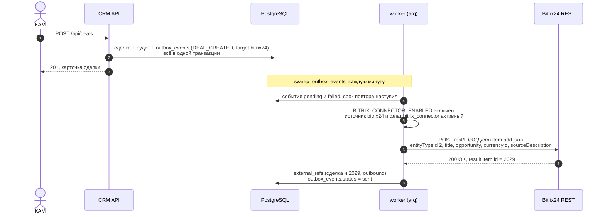
```mermaid
sequenceDiagram
    autonumber
    actor K as КАМ
    participant A as CRM API
    participant DB as PostgreSQL
    participant W as worker (arq)
    participant B as Bitrix24 REST

    K->>A: POST /api/deals
    A->>DB: сделка + аудит + outbox_events (DEAL_CREATED, target bitrix24)<br/>всё в одной транзакции
    A-->>K: 201, карточка сделки
    Note over W,DB: sweep_outbox_events, каждую минуту
    W->>DB: события pending и failed, срок повтора наступил
    W->>W: BITRIX_CONNECTOR_ENABLED включён,<br/>источник bitrix24 и флаг bitrix_connector активны?
    W->>B: POST rest/ID/КОД/crm.item.add.json<br/>entityTypeId 2, title, opportunity, currencyId, sourceDescription
    B-->>W: 200 OK, result.item.id = 2029
    W->>DB: external_refs (сделка и 2029, outbound)<br/>outbox_events.status = sent
```

* **Очередь событий (outbox), а не прямой вызов из запроса.** Событие `DEAL_CREATED` пишется в `outbox_events` в той же транзакции, что сделка и запись аудита — у этих двух строк одинаковое `created_at` до микросекунды (`now()` в PostgreSQL — время начала транзакции, видно на скриншотах ниже). Сделка не пропадёт, если Битрикс недоступен, а недоступный Битрикс не тормозит КАМа: ответ `201` уходит сразу. Воркер (`arq`, `sweep_outbox_events`, [`integration/tasks.py`](https://github.com/lct-testkit/backend/blob/main/app/modules/integration/tasks.py)) разбирает очередь раз в минуту.
* **Канал — входящий вебхук Битрикса** (`https://{портал}/rest/{user_id}/{код}/`), методы `crm.item.add` / `crm.item.update` / `crm.item.get` с `entityTypeId=2` (сделка). Старые `crm.deal.*` в документации Битрикса помечены остановленными — не используются. Секрет — сам URL: в БД лежит только **имя** переменной окружения (`BITRIX_WEBHOOK_URL`), значение — в `.env` бэкенда, в логи оно не попадает (см. «Что нашли по дороге»). Код — [`integration/bitrix.py`](https://github.com/lct-testkit/backend/blob/main/app/modules/integration/bitrix.py).
* **Что уходит:** `title`, `opportunity` (сумма), `currencyId`, `sourceId` (`OTHER`) и `sourceDescription` — `CRM #<номер сделки>`: по нему сделку в Битриксе видно и в обратную сторону.
* **Связь сделок** — таблица `external_refs`: id у нас ↔ id в Битриксе, версия, направление (вкладка «Связи»). По ней следующие изменения уходят как `crm.item.update`, а не создают дубль.
* **Сбой доставки — не потеря.** Повторы с паузой 1 с, 5 с, 30 с, 5 мин, 30 мин, 2 ч; после 8-й неудачи событие становится `dead` и ждёт ручного разбора на вкладке «Исходящие».
* **Конфликты.** Перед `crm.item.update` читаем `crm.item.get` и сравниваем `updatedTime` с нашей последней синхронизацией: если сделку в Битриксе правили после неё, мы её не затираем — доставка падает с ошибкой «требует ручного разбора» и идёт по тому же циклу повторов.

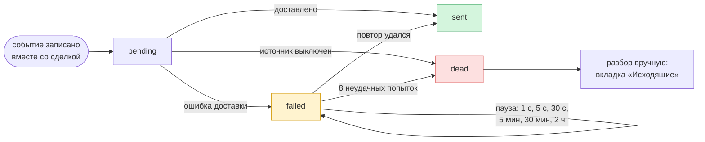
```mermaid
flowchart LR
    E(["событие записано<br/>вместе со сделкой"]) --> P["pending"]
    P -->|"доставлено"| S["sent"]
    P -->|"ошибка доставки"| F["failed"]
    P -->|"источник выключен"| D["dead"]
    F -->|"повтор удался"| S
    F -->|"8 неудачных попыток"| D
    F -->|"пауза: 1 с, 5 с, 30 с,<br/>5 мин, 30 мин, 2 ч"| F
    D --> M["разбор вручную:<br/>вкладка «Исходящие»"]
    style S fill:#d4f5dd,stroke:#2e9e57
    style D fill:#fde0e0,stroke:#d94a4a
    style F fill:#fff3cf,stroke:#d9a520
```

### Как включить

Нужны все условия:

1. В `.env` бэкенда: `BITRIX_CONNECTOR_ENABLED=true` и `BITRIX_WEBHOOK_URL=https://<портал>/rest/<id>/<код>`, затем `docker compose up -d api worker`. Вебхук создаётся в самом Битриксе: «Разработчикам» → «Другое» → «Входящий вебхук», права — только **CRM**. Код источника сделки (`sourceId`) настраивается переменной `BITRIX_SOURCE_ID`, по умолчанию `OTHER`.
2. В CRM под администратором: «Настройка» → «Интеграции» → «Источники» → переключатель «Bitrix24». Пока он выключен, события уходят в `dead` со `source_inactive`.
3. Флаг функции `bitrix_connector` на экране «Настройки» — третье условие: если строка флага есть и выключена, события уходят в `dead` с `feature_flag_disabled` (вернуть их в очередь можно запросом `POST /api/admin/integrations/outbox-events/{id}/retry`); если строки флага нет, доставку он не блокирует.
4. Тестируйте одной сделкой с очевидным названием. Удаление в Битрикс не синхронизируется — тестовую сделку там удаляют руками; после проверки источник выключают, а вебхук отзывают.

### Прогон на живом портале, 25.09.2026

| 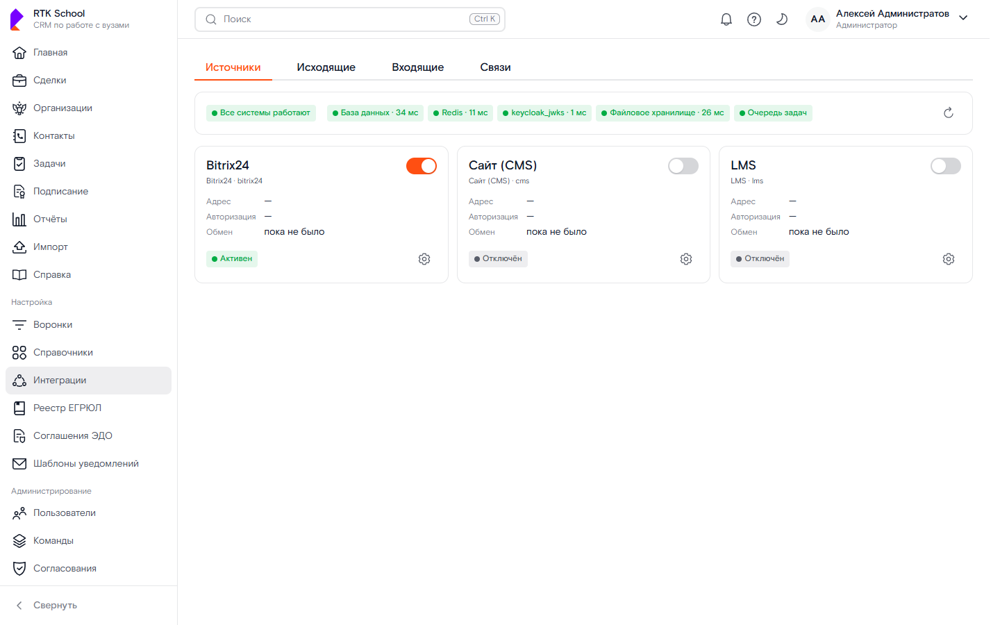 | 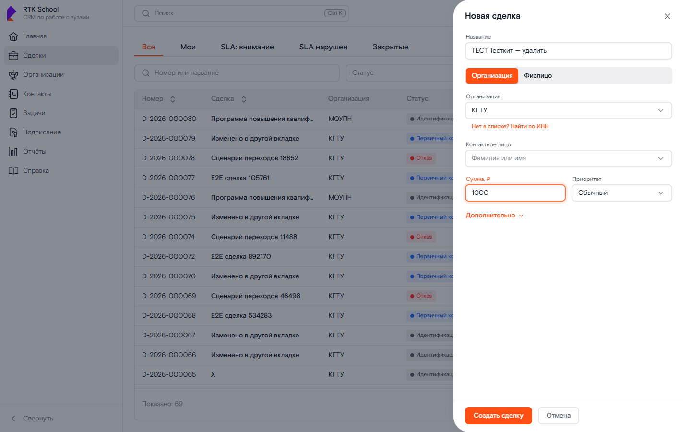 |
|:-:|:-:|
| *1. Администратор включает источник «Bitrix24» — чип «Активен»* | *2. КАМ создаёт сделку «ТЕСТ Тесткит — удалить», 1 000 ₽* |
| 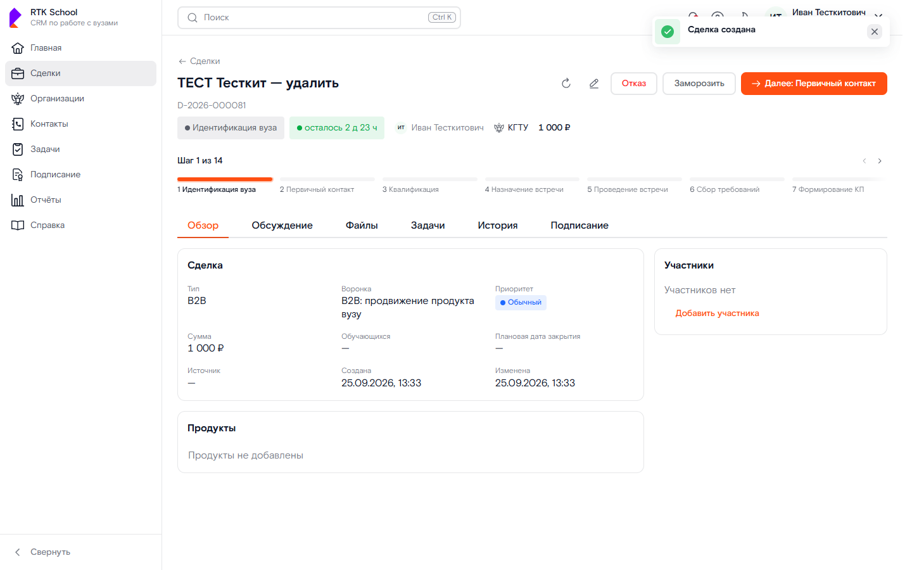 | 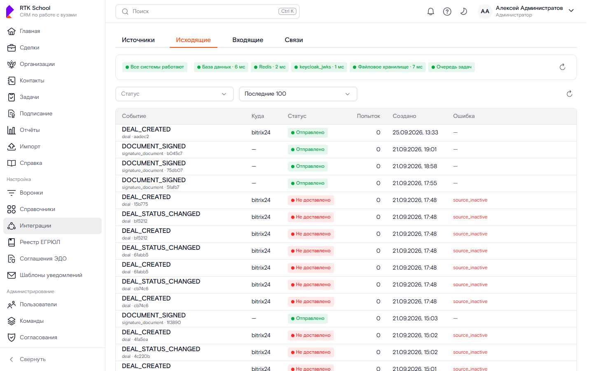 |
| *3. Сделка создана — `D-2026-000081`, 13:33 МСК* | *4. Через ~45 с в «Исходящих» — «Отправлено». Ниже старые «Не доставлено / source_inactive» с 21.09, когда источник был выключен* |
| 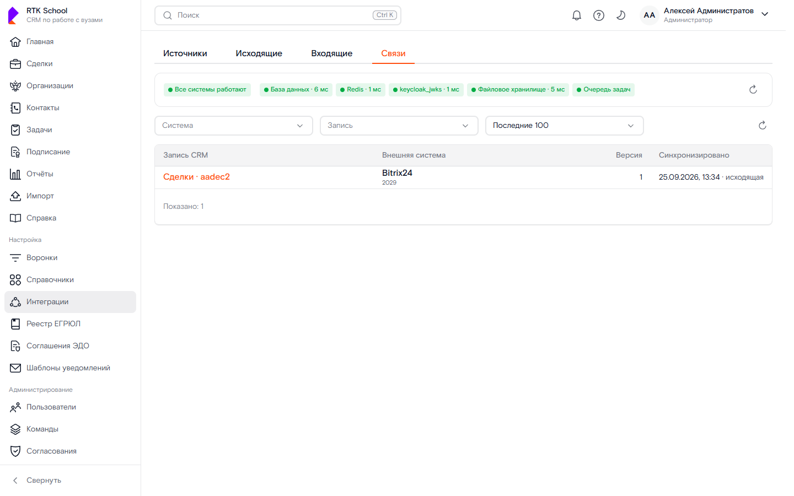 | 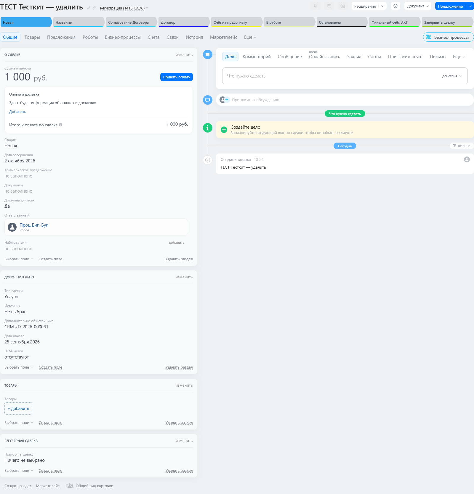 |
| *5. «Связи»: наша сделка ↔ Bitrix24 `2029`* | *6. В Битриксе — сделка 2029: название, сумма, «Дополнительно об источнике: CRM #D-2026-000081»* |
| 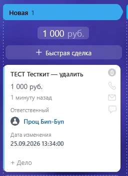 | 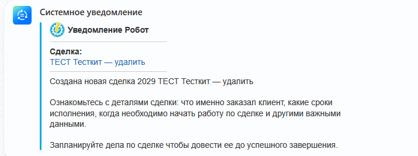 |
| *7. Канбан воронки, колонка «Новая» (остальное скрыто — там данные клиентов компании)* | *8. Сработала автоматизация самого портала — уведомление «Создана новая сделка 2029»* |

### Что показывает, что отправила именно система

Не ручное создание в Битриксе и не скриншот-«рисунок»: у каждой строки ниже свой источник — команда, которой она получена, видна в шапке скриншота.

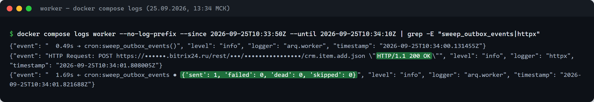

*Воркер: цикл `sweep_outbox_events`, исходящий `POST …/crm.item.add.json` и ответ `200 OK`, итог `{'sent': 1, …}`. Портал и код вебхука замазаны. Строка `httpx` — из версии до исправления утечки секрета (ниже): сейчас такие строки в лог не пишутся.*

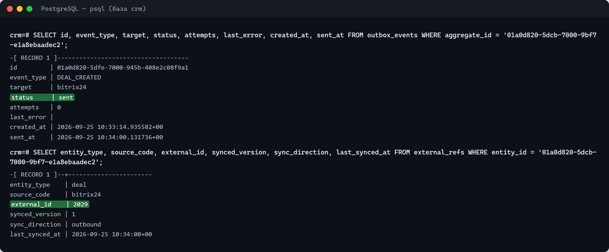

*БД: событие `DEAL_CREATED` → `bitrix24` со статусом `sent` (создано 10:33:14, отправлено 10:34:00 UTC), попыток 0, ошибок нет; в `external_refs` — `external_id = 2029`. Это id, который вернул Битрикс: узнать его иначе, чем вызвав API, было нельзя.*

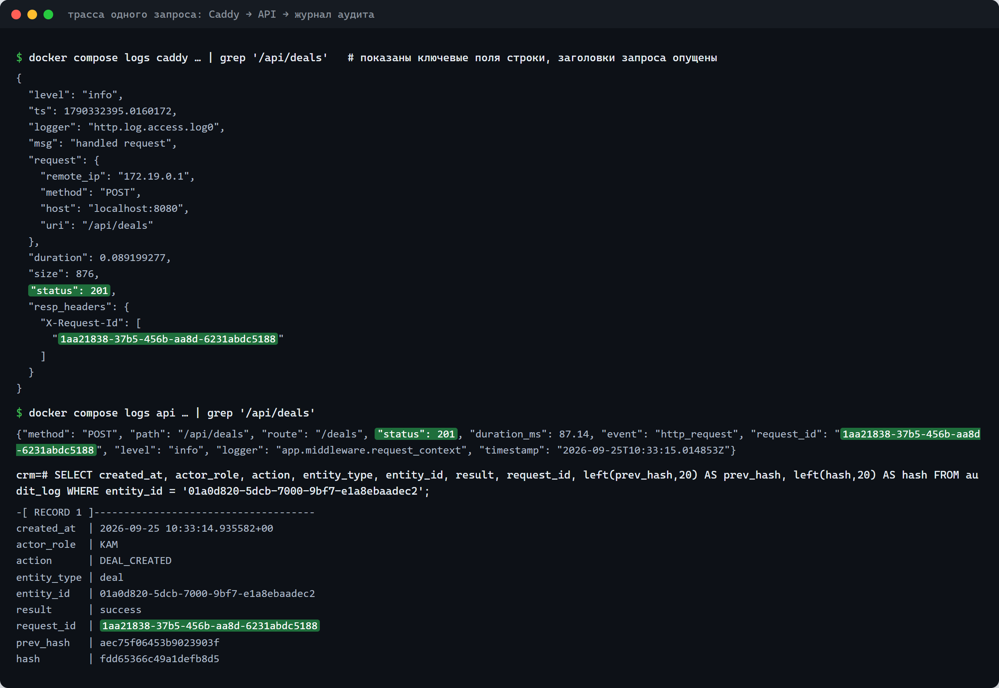

*Трасса одного запроса: один и тот же `X-Request-Id` в access-логе Caddy, в логе API (`201`, 87 мс) и в записи журнала аудита `DEAL_CREATED` с цепочкой хэшей (`prev_hash` → `hash`).*

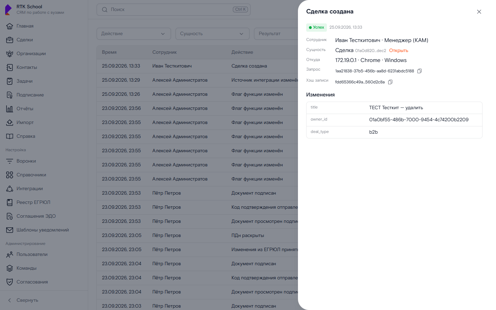

*Тот же запрос в интерфейсе журнала аудита: слева хронология — 13:26 флаг функции, 13:29 источник интеграции, 13:33 сделка; справа запись с тем же идентификатором запроса и хэшем.*

### Чего нет — честно

* **Битрикс → CRM реальными событиями.** Наш `POST /api/v1/integrations/bitrix/webhook` принимает упрощённый собственный контракт с HMAC-подписью; настоящий исходящий вебхук Битрикса шлёт другой формат и подписи не даёт. Настоящая подписка на события (`event.bind`) требует зарегистрированного локального приложения на портале и публичного адреса стенда — здесь не поднята, честно описано в докстринге [`integration/bitrix.py`](https://github.com/lct-testkit/backend/blob/main/app/modules/integration/bitrix.py).
* **Стадия, воронка, ответственный, компания, контакт, удаление не синхронизируются.** Это идентификаторы на стороне портала, надёжной таблицы соответствия нет. Новая сделка попадает в воронку по умолчанию на первую стадию.
* **`sourceId` зашит как `OTHER`.** В справочнике источников этого портала такого кода нет, поэтому поле «Источник» в Битриксе пустое («Не выбран»), а текст источника лежит в «Дополнительно об источнике». Код источника стоит брать из настроек портала.
* **Автоматизация портала срабатывает** (роботы, уведомления) — на боевом портале это видят живые люди.

### Что нашли по дороге

* **Флаг функции `bitrix_connector` был ловушкой интерфейса.** Он выглядел как главный выключатель, но код его не читал: при проверке его включили вместо источника, и доставки не было. С 25.09.2026 флаг — третье условие доставки ([`docs/backend-issues.md`](docs/backend-issues.md) №39).

## Соглашения

* **Стили — только утилиты Tailwind.** Блоков `<style>` нет, кроме одного обхода дизайн-системы (`ui/fields/Pick.svelte`: список `Select` под `Drawer`). Слои: `@layer theme, base, rtui, components, utilities` — rt-ui в `rtui`, ниже утилит; CSS rt-ui из JS не импортируется (неслойный CSS победил бы любой слой).
* **Брейкпоинты rt-ui:** телефон < 768 (`max-md:`), планшет 768–1023 (`md:`), десктоп ≥ 1024 (`lg:`). Радиусы — `rounded-sm/md/lg/full`; `rounded-s/m/l` — это стороны, тест `class-names.test.ts` их запрещает. Двойное подчёркивание в произвольных селекторах Tailwind превращается в пробел.
* **Поле формы:** по умолчанию размер m (36 px), на телефоне l (48 px); подпись над рамкой, подсказка или ошибка под ней. В строке фильтров подписи нет — её роль играет плейсхолдер. Кнопки: главная первой, «Отмена» после неё; на телефоне столбиком, главная внизу; размер `auto` (m на десктопе, l на телефоне).
* **Страница:** одна ось слева и справа, отступ 24 px (планшет 16, телефон 12), между блоками 16 (телефон 12); первая строка страницы — 36 px (48 на телефоне) на одной высоте на всех экранах; отдельной строки с одними кнопками над фильтрами или вкладками нет.
* **Три состояния у каждого экрана:** загрузка (`Skeleton` того же места и высоты), пусто (что делать: одно действие), ошибка (человеческая фраза и «Повторить», для 5xx — код обращения).
* **Фильтры живут в адресной строке** (`utils/query-state.svelte.ts`): ссылка воспроизводит вид, «Назад» и перезагрузка работают.
* **Права:** интерфейс скрывает недоступное по `scopes` из `/api/me` (`session.can('deal:update')`), но авторитет — бэкенд. Ctrl+K ловится по `e.code === 'KeyK'` и работает в любой раскладке.
* **Утверждённые блоки не меняются без запроса заказчика.** Там, где в rt-ui есть компонент, используется он ([`docs/DS-MIGRATION.md`](docs/DS-MIGRATION.md)); свой код объясняется строкой комментария. Пакетный менеджер — pnpm.

## API-клиент и авторизация

* **Клиент** (`lib/api/client.ts`): `openapi-fetch` по типам `schema.d.ts`; `unwrap(api.GET(...))` возвращает данные или бросает `ApiError` (тело RFC 7807, `errors[]` по полям, `request_id`). Тексты кодов `CRM-XXYY` — в `errors.ts`.
* **Заголовки:** `X-Request-Id` на каждом запросе; `Idempotency-Key` (`idem()`) — один ключ на одну логическую отправку; `If-Match: "<версия>"` (`ifMatch()`) при правке; в prod к каждому изменяющему запросу добавляется `X-CSRF-Token` из cookie `crm_csrf`.
* **Пагинация** курсорная (`{ items, next_cursor }`, limit до 100): класс `Pager` в `pager.svelte.ts`. **Файлы** не идут через API: `upload-intent` → PUT прямо в хранилище по подписанной ссылке → `commit` (`upload.ts`). **Имена коллег** — пакетный справочник `people` (`/api/users/directory`).
* **demo:** пароль-грант Keycloak, токены в `localStorage`, `Authorization: Bearer`; на 401 или `CRM-1103` — одно тихое обновление токена и повтор запроса. **prod:** серверная сессия BFF, вход — `/api/auth/login?next=…`, токенов в браузере нет.
* **События** (`auth/events.ts`): 401 — выход с пометкой «Сессия истекла», `CRM-1105` — окно согласия на ПДн, `CRM-1106` — смена пароля, `CRM-1104` — блокировка.
* **Схема:** `pnpm gen:api` пересоздаёт `src/lib/api/schema.d.ts`, `docs/openapi.json` и `docs/api-endpoints.md` из живого бэкенда.

## Экраны и права

Пункты меню показываются по правам из `/api/me → scopes` (`src/lib/nav.ts`); аудитор (`audit:read` без `deal:read`) после входа попадает на журнал аудита, остальные — на первый доступный пункт.

| Раздел | Маршруты (`src/routes/(app)`) | Право для показа в меню |
|---|---|---|
| Главная, сделки, задачи | `/`, `/deals`, `/deals/[id]`, `/tasks` | `deal:read` (главная — или `report:read`) |
| Организации, контакты | `/organizations[/id]`, `/contacts[/id]` | `organization:read`, `contact:read` |
| Подписание | `/signing`, `/signing/[id]`, `/signing/requests/[id]` | `signature:sign` или `signature:create` |
| Отчёты, импорт | `/reports` (+ `history`, `dashboards[/id]`), `/imports` (+ `new`, `[id]`) | `report:read`, `import:run` |
| Воронки, справочники | `/workflows[/id]`, `/catalog/*` (products, directions, loss-reasons, holidays, custom-fields, regions) | `workflow:write`, `catalog:write` |
| Настройка | `/admin/integrations`, `/admin/registry`, `/admin/edm`, `/admin/notification-templates` | `integration:admin`, `registry:import`, `edm:admin` или `edm:read`, `notification_template:manage` |
| Администрирование | `/admin/users[/id[/offboard]]`, `/admin/teams`, `/admin/approvals`, `/admin/erasure[/id]`, `/admin/audit`, `/admin/settings` | `user:read`, `user:write`, `erasure:manage`, `audit:read`, `settings:write` |
| Для всех вошедших | `/profile`, `/notifications` (+ `settings`), `/help` | без ограничений |
| Публичные, без входа | `/login`, `/sign/[token]`, `/verify/[[id]]`, `/invite/[token]` | — |

## Разработка

Dev-сервер на `0.0.0.0:5273` с `--strictPort` (занят порт — ошибка, а не другой порт), HMR и прокси на бэкенд; порт 5173 на машине разработчика занят другим проектом, поэтому клиент работает на 5273:

```bash
pnpm dev
```

Production-сборка: `vite build`, затем `tools/postbuild.mjs` выносит inline-скрипт SvelteKit в `/boot.js`, чтобы работала строгая CSP (`script-src 'self'`); результат — в `build/`:

```bash
pnpm build
```

Раздать `build/` на `:4273` с теми же прокси (так проверяется production-сборка: `APP_URL=http://localhost:4273 node tools/qa-all.mjs`):

```bash
pnpm preview
```

Типы и разметка (`svelte-kit sync` и `svelte-check`; `pnpm check:watch` — в режиме наблюдения), линтер и тесты:

```bash
pnpm check
```

```bash
pnpm lint
```

```bash
pnpm test
```

Пересоздать типы API из живого бэкенда (`--url <адрес или файл>` — другой источник):

```bash
pnpm gen:api
```

`pnpm install` сам выполняет `svelte-kit sync` (скрипт `prepare`). Конфигурация: `static/config.json` читается при старте (`cache: no-store`) — `mode`, `appName`, `keycloak` (`path`, `realm`, `clientId`, `clientSecret` только в demo), `demoAccounts`.

| Переменная | Где действует | По умолчанию | Назначение |
|---|---|---|---|
| `BACKEND_URL` | `pnpm dev`, `pnpm preview` (окружение или `.env` в этой папке) | `http://localhost:8080` | куда проксируются `/api`, `/public`, `/health`, `/auth`; Host подменяется, потому что издатель токенов Keycloak выводится из него |
| `APP_MODE`, `APP_NAME`, `KEYCLOAK_REALM`, `KEYCLOAK_CLIENT_ID` | образ `web` | `demo`, `CRM ИТ Школы`, `crm`, `crm-bff` | пишут `/config.json` при старте; `APP_NAME` учитывается только в prod и в compose не передаётся |
| `APP_URL` | `tools/` | `http://localhost:5273` | адрес клиента для проверок (`http://localhost:8080` — через Caddy) |
| `PW_CHANNEL` | `tools/` | `chrome` | канал браузера Playwright (`msedge` — Edge) |
| `REF_URL`, `REGISTRY_REIMPORT` | `ref-shot.mjs`, `seed-demo.mjs` | `http://127.0.0.1:5180`, — | витрина rt-ui; заново загрузить реестр ЕГРЮЛ |

### Один origin с API (dev-клиент за Caddy)

Нужен для OIDC-входа prod-режима при разработке: вход рассчитан на один origin с API и Keycloak (`http://localhost:8080`) и проверялся только там. При запущенном `pnpm dev` в `../backend/.env` задают `WEB_UPSTREAM=host.docker.internal:5273` и `CSP_SCRIPT_SRC="'self' 'unsafe-inline' 'unsafe-eval'"`, применяют `docker compose up -d --no-deps caddy` из `../backend` и открывают http://localhost:8080. Пока строки в `.env`, Caddy не отдаёт образ `web`: чтобы вернуться, удалите их и повторите команду.

## Проверка качества

**Гейты CI** (`.github/workflows/ci.yml`, обязательны для слияния и для публикации образа):

| Job | Что проверяет |
|---|---|
| `lint · check · test · build` | `pnpm lint` (ESLint), `pnpm lint:styles` (**stylelint: цвета только из токенов темы** — без `#hex`/`rgb()`/именованных цветов, спека §12.6), `pnpm check` (svelte-check), `pnpm test:coverage` (пороги в `vite.config.ts`: lines 45%, branches 78%, functions 82% — по измеренной базе 49/83/88), `pnpm build`, `pnpm size` (**бюджет gzip-размера бандла**, `tools/bundle-budget.json` — косвенная защита требования «отклик ≤ 1 с»), `pnpm audit --prod` |
| `контракт API · Dockerfile · секреты` | типы API не дрейфуют от `docs/openapi.json` (`gen-api` + `git diff --exit-code`); `docs/openapi.json` совпадает с `backend@main` (`tools/check-contract.mjs`, нужен секрет `BACKEND_READ_TOKEN`, ночью и на PR); hadolint; Trivy fs (уязвимости, секреты) |
| публикация образа | только `main`, после обоих job'ов: общий конвейер в `lct-testkit/deploy` — сборка → Trivy до push → push → SBOM/provenance → cosign → dispatch |

Локально то же самое: `pnpm lint && pnpm lint:styles && pnpm check && pnpm test:coverage && pnpm build && pnpm size`. Если рост бандла осознанный — `node tools/check-bundle-size.mjs --update` и объяснение в PR.

Прогон от 25.09.2026 (папка `frontend`): `pnpm test` — 32 файла, 232 теста, все пройдены (Vitest 3.2.7); `pnpm check` — 2577 файлов, 0 ошибок, 0 предупреждений; `pnpm lint` — без замечаний. Тесты покрывают чистую логику: валидаторы ИНН, DSL и граф воронок, условия переходов, SLA, OTP и хэши подписи, аудит, согласования, увольнение, удаление ПДн, импорт, отчёты, запрет `rounded-s/m/l`. ESLint (`pnpm lint`) — правила и осознанные исключения в `eslint.config.js`.

Инструменты `tools/*.mjs` работают против живого клиента: адрес — `APP_URL` (по умолчанию `http://localhost:5273`), вход по паролю, поэтому нужны demo-конфиг и запущенный бэкенд; используется системный Chrome. В Git Bash путь вроде `/deals` не портится: инструменты исправляют подмену `C:/Program Files/Git`. Скриншоты пишутся в `.shots/` (в git не попадает).

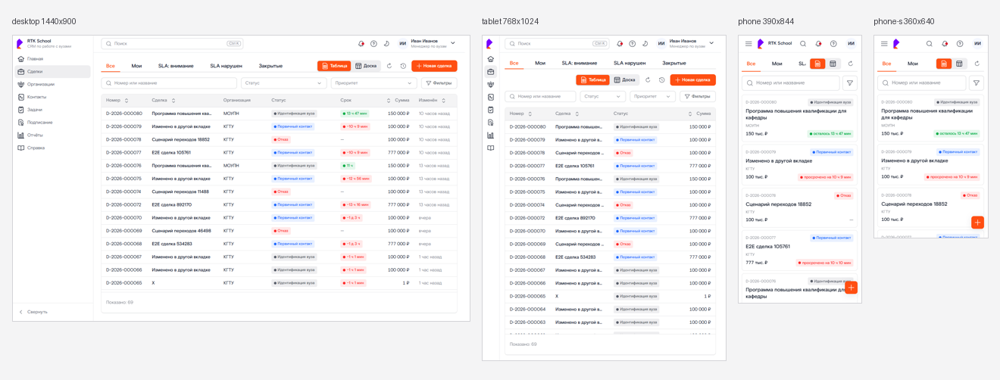

*Тот же экран на четырёх размерах — снимок `tools/shot.mjs --sizes all`, который смотрят `qa-all.mjs` (вёрстка) и `buttons.mjs` (каждая кнопка) на каждом.*

| Инструмент | Что проверяет | Пример |
|---|---|---|
| `qa-all.mjs` | все маршруты (`routes.mjs`: каждый `+page.svelte` кроме `dev/`, `[id]` берётся из живого API) × роли × размеры: горизонтальная прокрутка, вылеты за экран, обрезанные колонки таблиц, ошибки консоли, упавшие запросы, редиректы; печатает только проблемы | `node tools/qa-all.mjs --as kam,head --sizes desktop,phone --only /deals` |
| `buttons.mjs` | обход **всех кнопок** каждого экрана под каждой ролью (см. ниже) | `node tools/buttons.mjs --as kam,head,admin,auditor` |
| `tops.mjs` | первая строка каждой страницы на одной линии под верхней панелью (36 px, на телефоне 48; допуск 2 px) | `node tools/tops.mjs --as admin --size 390x844` |
| `axes.mjs` | левая и правая ось контента каждой страницы, отмечает выбивающиеся | `node tools/axes.mjs --as admin --size 1024x768` |
| `taps.mjs` | интерактивные элементы на телефоне меньше 44×44 px (с эмуляцией касаний, `pointer: coarse`) | `node tools/taps.mjs --as kam --urls /deals,/tasks` |
| `shot.mjs` | скриншоты маршрута в нескольких размерах и аудит вёрстки; `--guides` рисует линии выравнивания (`guides.mjs`), `--hover`, `--dpr`, `--clip` | `node tools/shot.mjs --as kam --url /deals --sizes desktop,phone` |
| `forms-shots.mjs` | открывает (не отправляет) каждую панель, окно и мастер и снимает; результат в `../frontend-shots/forms` | `node tools/forms-shots.mjs --sizes desktop,phone --only deal,user` |
| `sheet.mjs` | склеивает скриншоты папки в один лист | `node tools/sheet.mjs --dir ../frontend-shots/forms --match desktop-light --out ../frontend-shots/sheet-1.png` |
| `probe.mjs` | выполняет JS на странице и печатает результат | `node tools/probe.mjs --as kam --url /contacts --js "document.title"` |
| `ref-shot.mjs` | скриншоты витрины rt-ui — эталона для блоков (нужен `npm run dev` в `rt-ui`, порт 5180) | `node tools/ref-shot.mjs --url /examples/crm --sizes desktop,phone` |
| `seed-demo.mjs` | демо-данные через API (идемпотентно), см. [корневой README](https://github.com/lct-testkit/.github#демо-данные) | `node tools/seed-demo.mjs` |
| `gen-api.mjs`, `coverage.mjs` | типы и схема из бэкенда; какие из 203 операций OpenAPI вызывает интерфейс (175 — разбор непокрытых в [`docs/STATUS.md`](docs/STATUS.md#покрытие-ручек-175-из-203-86)) | `node tools/coverage.mjs` |

Служебные файлы папки: `lib.mjs` (общие помощники, `APP_URL`, `PW_CHANNEL`, размеры, вход по паролю), `routes.mjs` (маршруты роли для `qa-all` и `buttons`), `postbuild.mjs` (шаг `pnpm build`), `edit-ui.mjs` (помощник правок, не проверка); `_x2.mjs` — черновой скрипт, не инструмент.

**`buttons.mjs` — обход всех кнопок.** Открывает каждый маршрут под ролью, нажимает каждую кнопку, ссылку, вкладку, пункт меню, переключатель и флажок и всё внутри панелей, меню и окон, которые они открывают, — на три уровня вглубь; записывает, что вышло: переход на страницу, открылось окно, ушёл запрос, изменилась страница или ничего не произошло. Проверяет также, что каждое окно закрывается по Escape. Изменения на сервере невозможны: любой POST/PUT/PATCH/DELETE к `/api`, `/auth` (кроме обновления токена) и хранилищу файлов подменяется заглушкой «ok», чтение (GET) идёт в живой бэкенд — скрипт лишь записывает, какой запрос отправила кнопка. Результат — по строке на элемент в `<out>/<роль>-<размер>.jsonl` (по умолчанию `.shots/buttons`); читает его `tools/buttons-report.mjs` (файл появится позже). Параметры: `--as`, `--size`, `--only`, `--out`, `--inventory` (только перечень), `--shell` (боковое меню и верхняя панель на каждом маршруте, а не только на первом), `--per-sig` (из однотипных элементов нажимаются первые N), `--budget` (секунд на маршрут).

### Сценарии `tools/scenarios/`

Запуск — `node tools/scenarios/<имя>.mjs` из папки `frontend`; нужны бэкенд и dev-сервер (или `APP_URL`). Сценарии работают на живых данных и создают записи, а удаления у многих сущностей в бэкенде нет, поэтому часть не идемпотентна. Из 40 файлов `a-lib.mjs` — библиотека помощников.

| Сценарий | Что проверяет | Побочные эффекты |
|---|---|---|
| `a-deal-flow` | сделка сквозным путём: создание, переход, комментарий, задача, файл | каждый запуск создаёт сделку «E2E сделка NNNNNN» |
| `a-transition-flow`, `a-board-flow`, `a-reassign-flow` | диалог перехода (блокировка, отказ с причиной, конфликт `CRM-1002`); доска (перетаскивание, AUDITOR без доступа); смена ответственного (HEAD) | создают сделки |
| `a-misc-flow` | комментарии (ответ, правка, удаление), участники, раскрытие контакта, колокольчик, массовая передача | сделка `D-2026-000002`, комментарии |
| `a-org-flow`, `a-drift-flow` | организации: автоподстановка по названию и ИНН, ошибка контрольной суммы, дубль, создание из реестра; баннер расхождений с ЕГРЮЛ | нужен реестр из `seed-demo`; для `a-drift-flow` — организация с расхождением |
| `b-workflow`, `b-workflow-guard`, `b-workflow-published` | редактор воронок: создание, статус, SLA, условия, сохранение, конфликт 409, публикация, архивация; защита от потери правок; граф опубликованной воронки со сделками | `b-workflow` создаёт воронку «B2C: короткая воронка» (удаления воронок нет) |
| `b-catalog`, `b-seed-catalogs`, `b-imports`, `b-reports`, `b-admin` | справочники и их сид; импорт xlsx на 240 строк и csv; отчёты и дашборд; реестр ЕГРЮЛ, интеграции, шаблоны уведомлений под ADMIN | создают данные; нужны сиды отчётов, уведомлений, интеграций и файлы `.shots/b-data` |
| `c-audit`, `c-deal-signing`, `c-sign` | журнал аудита и проверка цепочки; мастер отправки на подпись; подпись внешним подписантом (`--flow`: sign, reject, wrong, internal) | каждый запуск создаёт документ (ссылка одноразовая); профиль бэкенда не prod |
| `lead-prod-login`, `lead-session` | prod: аноним → «Войти» → Keycloak → cookie-сессия → CSRF → выход; demo: тихое обновление токена | `APP_URL=http://localhost:8080`; принимает согласие ПДн |
| `lead-edm`, `lead-seed-erasure`, `lead-erasure` | соглашения ЭДО; «Удаление ПДн» и «Согласования»: два администратора проходят «четыре глаза» | `lead-edm` создаёт соглашение при каждом запуске |
| `a-phone-shots`, `d-shots`, `d-shots2`, `b-shot-imports`, `b-shot-wf`, `lead-search`, `a-cleanup` | скриншоты (телефон, диалоги, мастер импорта, редактор воронки, поиск Ctrl+K); уборка следов сценариев | `d-shots` создаёт сделку; `a-cleanup` меняет данные |
| `a-css`, `a-tokens`, `a-menu-z`, `a-debug`, `a-id`, `a-comment-debug`, `a-comment-delete`, `lead-debug`, `lead-debug2` | отладочные помощники, не проверки | `lead-debug2` привязан к id запроса |

## Образ web

Клиент собирается в статический образ, который стоит за основным Caddy стека (`../backend/deploy/Caddyfile`: `/api`, `/public`, `/health` → FastAPI, `/auth` → Keycloak, остальное → `web`). Нужны токен чтения пакета (`docker build --secret id=npm_token,env=NODE_AUTH_TOKEN`) и, по желанию, `static/fonts/*.woff` (выдаёт заказчик):

```bash
docker build -t rtk-crm-web .
```

Два этапа (оба базовых образа закреплены по digest, обновляет Dependabot): `node:22-alpine` с pnpm 11.13.1 (`pnpm install --frozen-lockfile`, кэш-маунт pnpm store, `pnpm build`), затем `caddy:2.11-alpine` со статикой в `/srv` на порту 3000 **под непривилегированным пользователем `web` (UID 10001)** (не 2.8 — Trivy 22.09.2026 нашёл там 87 CVE, 5 CRITICAL, см. `.trivyignore`); `HEALTHCHECK` читает `/config.json`. `deploy/docker-entrypoint.sh` при старте пишет `/srv/config.json`: в prod — без демо-учёток и client secret, в demo — оставляет запечённый конфиг, выставляет `mode` и подставляет `clientSecret` из переменной `KEYCLOAK_CLIENT_SECRET` (стек, установленный со сгенерированными секретами, иначе не смог бы войти). `deploy/Caddyfile.web` ставит `Cache-Control: no-cache` на `config.json`, `boot.js`, `index.html`, годовой `immutable` — на `_app/immutable/*` и `fonts/*`, а неизвестные пути отдаёт как `index.html` (роутер SPA). В контекст сборки не попадают `docs` и `tools/scenarios` (`.dockerignore`). Весь стек с клиентом поднимается профилем compose `web`; переключение demo и prod, переменные и запуск — [корневой README](https://github.com/lct-testkit/.github#полноценная-версия).

## Ограничения и известные проблемы

* **Каталоги «Направления», «Причины отказа», «Календарь»** не переведены на `DataTable` (у них свой вид списка); каталог блоков `src/routes/dev` по плану удаляется перед выдачей (в production-сборку не попадает и сейчас).
* **Редактор воронки на телефоне без перетаскивания** (по плану); «Сохранить» и «Опубликовать» стоят отдельным рядом под заголовком.
* **Вебхуки внешних систем без экрана** (`POST /api/v1/integrations/{cms/leads, lms/progress, bitrix/webhook}`): подписаны секретом, которого в браузере быть не должно; на карточке источника есть «паспорт» с примером `curl`. Ещё без экрана сознательно — поток OIDC (3 ручки) и health-пробы (2): 8 из 203. Ещё 20 — новые ручки бэкенда: 8 от 22.09.2026 (лицензии, данные отчёта в JSON, 5 `DELETE`) и 12 от 25.09.2026 (повтор доставки, предпросмотр шаблона, `PATCH /me`, счётчик уведомлений, PDF подписи с того же origin, переиздание ссылки, продукты сделки, `PATCH` воронки, задача переноса, карточка команды); под них пока не строился UI — разбор в [`docs/STATUS.md`](docs/STATUS.md#покрытие-ручек-175-из-203-86).
* **Битрикс24 — только в одну сторону** (CRM → Битрикс): реальные события Битрикса в CRM не принимаются, стадии, ответственные и удаление не синхронизируются — [раздел выше](#интеграция-с-битрикс24).
* **Ограничения бэкенда** ([`docs/backend-issues.md`](docs/backend-issues.md)): нет `DELETE` у праздников производственного календаря (остальные справочники и воронки уже получили); в демо остались тестовые записи прогонов сценариев — новыми `DELETE`-ручками ещё не почищены.
* **Ловушки rt-ui**, на которые пришлось обходить ([`docs/REBUILD-PLAN.md`](docs/REBUILD-PLAN.md), §6): `Popover` с `showCloseButton` по умолчанию ничего не рисует; списки `Select` и `InputDate` внутри `Drawer` открываются под ним (обход — одна переменная в `Pick.svelte`); у `Accordion` нет `<button>` в заголовке; кнопки `InlineNotification` всегда «тихие».
* **Нет анимаций окон и колец фокуса**, если в Windows отключены эффекты анимации: браузер сообщает `prefers-reduced-motion`, и дизайн-система отключает движение — так задумано.
* **Справка `/help`** — 13 глав: 8 пользовательских со скриншотами реального интерфейса, задачи и уведомления, интеграции (со скриншотами), клавиатура и темы, «О проекте» и глава «Дизайн-система» с живыми компонентами rt-ui ([`src/lib/content/help`](src/lib/content/help), [`static/help`](static/help)). Иконка «?» в шапке и пункт меню «Справка» несут акцентную точку, пока справку не открыли после обновления глав (`HELP_REV` в `stores/help-attention.svelte.ts`).

## Шрифт и лицензия

Rostelecom Basis и пакет `@lct-testkit/rt-ui` — материалы Ростелекома: `static/fonts` не коммитится (`.gitignore`), пакет `rt-ui` приватный (GitHub Packages, доступ выдаётся репозиториям организации); без шрифта интерфейс использует запасную гарнитуру. Исходный код доступен для ознакомления и оценки жюри хакатона, остальные права защищены (файл [`LICENSE`](LICENSE)).

| Документ | Что внутри |
|---|---|
| [`docs/STATUS.md`](docs/STATUS.md) | состояние клиента, как посмотреть, покрытие ручек (175 из 203), как проверять, известные ограничения |
| [`docs/REBUILD-PLAN.md`](docs/REBUILD-PLAN.md) | замечания заказчика, блоки B1–B15 и критерии приёмки, правила раскладки (§9), что принято |
| [`docs/USERFLOWS.md`](docs/USERFLOWS.md) | пользовательские потоки по ролям: задача, экраны, блоки, обязательные состояния |
| [`docs/DS-MIGRATION.md`](docs/DS-MIGRATION.md) | что на что менять при переводе самописных элементов на rt-ui |
| [`docs/backend-issues.md`](docs/backend-issues.md) | проблемы и несоответствия бэкенда, обходы (в том числе про сиды отчётов, уведомлений и интеграций) |
| [`docs/LEAD-DECISIONS.md`](docs/LEAD-DECISIONS.md), [`docs/lead-requests.md`](docs/lead-requests.md) | общие решения и правки бэкенда, сделанные для клиента; запросы к общему слою |
| [`docs/openapi.json`](docs/openapi.json), [`docs/api-endpoints.md`](docs/api-endpoints.md) | схема и индекс 203 операций; генерируются `pnpm gen:api` |
| [`docs/AGENT-BRIEF.md`](docs/AGENT-BRIEF.md), [`docs/plan-crm.md`](docs/plan-crm.md), [`docs/plan-config.md`](docs/plan-config.md), [`docs/plan-identity-signing.md`](docs/plan-identity-signing.md), [`docs/handoff-C.md`](docs/handoff-C.md) | история первой сборки, справочно |
| [`../README.md`](https://github.com/lct-testkit/.github#readme) · [`../backend/README.md`](https://github.com/lct-testkit/backend#readme) · [`../rt-ui/README.md`](https://github.com/lct-testkit/rt-ui#readme) | продукт целиком и стенд · бэкенд · дизайн-система |
